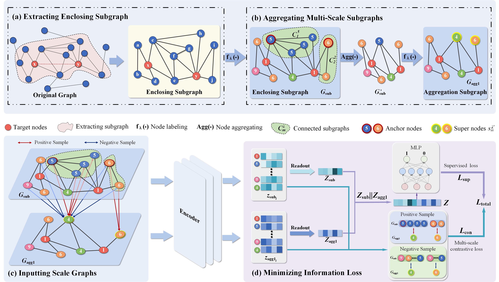

# 项目名称（MCAS）

Yao Y, Guo P, Mao Z, et al. Multi-scale contrastive learning via aggregated subgraph for link prediction[J]. Applied Intelligence, 2025, 55(6): 1-20.


## 🧠 Abstract

Link prediction seeks to uncover potential or future connections within a network using structural or attribute information. Recently, Graph Neural Network (GNN)-based methods have attracted considerable attention for their effectiveness in link prediction. However, most GNN-based approaches focus solely on single-scale input graphs, which limits their ability to comprehensively capture network structure information. In this paper, multi-scale subgraphs are introduced as input graphs to obtain complementary network structures from different perspectives. Simultaneously, to obtain embedding vectors with better representational capacity, contrastive loss from self-supervised learning is incorporated for link prediction. Specifically, Multi-scale Contrastive learning framework based on Aggregated Subgraph (MCAS) is proposed for predicting missing links. Firstly, we construct enclosing subgraph by extracting neighbors of target nodes. By applying aggregation operation to these subgraphs, different granularities of multi-scale subgraphs are obtained. Secondly, encoders are used to learn information from multiple scales of subgraphs separately. Next, contrastive learning is employed to achieve information balance among the multi-scale subgraphs. Finally, the minimization of the loss allows us to improve the model’s robustness. Empirical evidence indicates that our approach excels state-of-the-art methods on nine datasets, including biological and citation networks.

## 🖼️ Method Overview

<p align="left">
  
</p>

*Figure: Overall framework of MCAS for link prediction.*
## 🔗 Code

Click here to visit the code repository 👉[https://github.com/yabingyao/MCAS4LinkPrediction]

## 📝 Citing

If you find **MCAS** useful in your research, please consider citing the following paper:

```bibtex
@article{MCAS-2025,
  title={Multi-scale contrastive learning via aggregated subgraph for link prediction},
  author={Yabing Yao and Pingxia Guo and Zhiheng Mao and Ziyu Ti and Yangyang He and Fuzhong Nian and Ruisheng Zhang and Ning Ma},
  journal={Applied Intelligence},
  pages={1-20},
  year={2025},
  publisher={Springer},
  doi={https://doi.org/10.1007/s10489-025-06394-5},
  url={https://link.springer.com/article/10.1007/s10489-025-06394-5}
}
